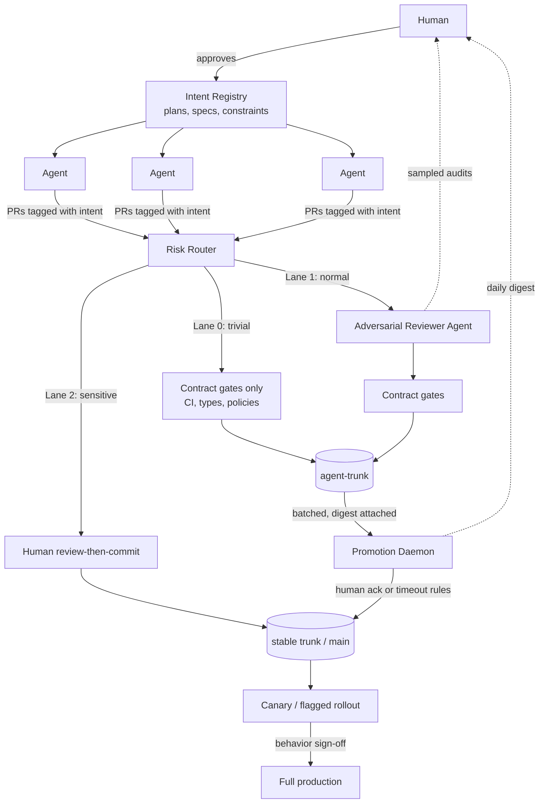

# Two-Trunk, Three-Lane: a merge pipeline for AI-speed development with human-paced trust

A design for version control where AI agents merge at machine speed, humans review
asynchronously at leverage points instead of per-diff, and everything that cannot be
reverted still waits for a person.

Built as a layer **on top of ordinary git** — no new object model, no new CLI. Git
stays the shared ledger both humans and agents can read; this design only changes
*who gates which merge, and when*.

---

## 1. The problem being solved

- Agents produce changes faster than humans can review them. Blocking every merge on
  human review caps the swarm at human speed (review-then-commit, RTC).
- Merging everything and reviewing later (commit-then-review, CTR) fails at volume:
  the review queue grows without bound, changes stack on unreviewed changes so revert
  stops being cheap, and side effects (migrations, deploys, leaked data) escape the
  repo where `git revert` cannot reach them.

**Design goal:** spend human attention on leverage points — plans, contracts,
reviewers, batches, behavior — not linearly, one review per change. Keep the
"cannot-be-reverted" boundary hard: anything whose consequences git cannot undo waits
for a human.

## 2. Principles

1. **Machines gate speed, humans calibrate trust.** Automated checks decide *whether*
   a change merges; humans decide *how much* to trust the automation, and tune it.
2. **Revertability is a budget, not an assumption.** A change is only allowed to skip
   human review if reverting it later genuinely undoes it. The pipeline enforces the
   conditions that keep revert cheap (flags, no coupled migrations, contained blast
   radius) rather than hoping for them.
3. **Review the right artifact at the right altitude.** Humans review intents before
   work starts, digests and behavior after — never a firehose of individual diffs.
4. **Untrusted by default, trust is earned and measured.** Reviewer agents and lanes
   have track records; routing thresholds move based on observed miss rates.

## 3. Architecture overview

Two trunks, three lanes, four human touchpoints (intent approval, Lane 2 reviews,
promotion digests, behavior sign-off). Everything else runs at machine speed.

## 4. Components

### 4.1 Intent Registry (review shifted *earlier*)

Every unit of agent work starts from a human-approved **intent**: a short structured
record containing the goal, the plan outline, interface commitments, and explicit
constraints ("do not touch `auth/`", "no schema changes", "public API stays
backward-compatible"). Stored in-repo (e.g. `intents/<id>.md`) so it versions with
the code.

- Every agent commit and PR carries its intent ID (commit trailer + PR label).
- A change that exceeds its intent's declared scope is auto-routed **up** a lane
  (see §5) regardless of its diff-based risk score.
- Intents are the unit the human approves — one approval covers all the changes that
  faithfully execute it. This is the single highest-leverage human act in the system:
  humans are good at "is this the right thing to build," machines at "was it built
  without breaking anything."

### 4.2 Risk Router

A deterministic classifier (rules first, model-assisted second — determinism keeps it
auditable and un-gameable) that scores each PR on blast radius:

| Signal | Examples |
|---|---|
| Paths touched | `auth/`, `billing/`, `migrations/`, `.github/`, secrets/config vs. `docs/`, `tests/` |
| Change type | schema migration, dependency bump, public API change, pure refactor |
| Reversibility | does it write data, send messages, change infra? (irreversible ⇒ Lane 2, always) |
| Intent match | in-scope for its approved intent, or exceeding it |
| Size & novelty | new external calls, new dependencies, large diffs |

Path-based rules live in a reviewable file (think `CODEOWNERS` for lanes, e.g.
`.mergelanes`), so tightening or loosening the routing is itself a small, humanly
reviewed change.

### 4.3 Contract gates (review *replaced* where it can be)

The machine-checkable definition of "correct": CI, type checks, property-based tests,
API-contract tests, security/policy scanners (no new network calls, no secret
patterns, dependency allowlist), and behavioral snapshot diffs. Contracts are the
*only* gate for Lane 0 — which is exactly why contract files themselves are Lane 2:
agents may propose contract changes but never self-approve them. Otherwise the letter
of the spec becomes the whole game and agents are excellent at satisfying letters
while violating spirits.

### 4.4 Adversarial Reviewer Agent (review shifted *up*)

Lane 1's gate. A separate agent — different prompt, ideally different model, with
zero shared context with the author — whose only job is to find reasons to reject:
correctness bugs, intent-scope violations, spirit-vs-letter contract dodges, security
smells. It cannot edit; it can only approve, reject with findings, or escalate to
Lane 2.

The human does not review Lane 1 diffs. The human **audits the reviewer**: a small
random sample of its approvals each week, plus every case where a reviewer-approved
change was later reverted. Miss rate is tracked; if it drifts, Lane 1 thresholds
tighten (more escalation to Lane 2) automatically. One human supervising a reviewer
that supervises many workers is where the scaling comes from.

### 4.5 Two trunks + Promotion Daemon (review shifted *later*, but batched)

- **`agent-trunk`** — agents integrate here continuously at full speed. This gives
  the swarm the coordination benefit of a shared trunk (everyone rebases on
  everyone's work immediately) without exposing the stable trunk to unreviewed churn.
- **`main` (stable trunk)** — revert-safe, human-trusted. Only the Promotion Daemon
  and Lane 2 merges write to it.

The **Promotion Daemon** cuts a promotion batch on a schedule (e.g. daily) or on
demand:

1. Collect the delta `agent-trunk..main`, grouped **by intent**, not by commit.
2. Run the full contract suite on the batch as a whole (changes that pass alone can
   fail together — this is where cross-change semantic conflicts surface).
3. Generate a human digest: per-intent summary, list of flagged items (router
   escalations, reviewer borderline calls, contract near-misses), and a random
   sample of N diffs for spot-checking.
4. Human acks the batch (or pulls specific intents out of it — the batch is
   re-cut without them, they stay on `agent-trunk` for scrutiny). Batches under a
   configurable risk budget may auto-promote on timeout if unacked, **except** any
   batch containing a flagged item — those always wait.

Batching bounds the stacking problem: nothing on `main` ever depends on more than one
batch of unreviewed history, so revert granularity is "an intent within a recent
batch," which stays tractable.

### 4.6 Behavioral gate (review of *behavior*, not code)

Everything promoted to `main` ships dark: behind feature flags, into shadow traffic
or canary. Promotion to full production requires sign-off on **observed behavior** —
metric deltas, output diffs, error rates — not on source. For most changes "did
anything users see change, and was it the change we wanted" is a better and much
faster human question than "do these 400 lines look right."

### 4.7 Revert protocol (keeping the premise true)

The pipeline *enforces* cheap revert instead of assuming it:

- **One intent = one revert unit.** The daemon promotes intents as coherent groups so
  `revert(intent)` is a single operation, even if it was 14 commits on `agent-trunk`.
- **Migrations and data writes never ride in Lane 0/1.** Anything irreversible is
  Lane 2 and ships as its own batch, decoupled from code by an expand/contract
  pattern.
- **Flags before behavior.** A revert of un-launched, flagged code is always safe by
  construction; that is the state most changes live in when a problem is found.
- **Revert is a first-class fast path**: one command, no review, auto-notifies the
  intent owner and feeds the reviewer-audit queue (every revert of an approved change
  is a labeled training/audit example).

## 5. The three lanes

| | Lane 0 — trivial | Lane 1 — normal | Lane 2 — sensitive |
|---|---|---|---|
| Examples | docs, tests, comments, mechanical refactors in low-risk paths | features, fixes, refactors within an approved intent | auth, billing, schema, contracts/CI config, deps, anything irreversible, intent-scope violations |
| Gate | contracts only | adversarial reviewer + contracts | human review-then-commit |
| Merges to | `agent-trunk` | `agent-trunk` | `main` directly |
| Human involvement | none (sampled in digests) | audits of the reviewer | full, blocking |
| Revert exposure | trivially revertable by construction | revertable; bounded by batch | may be irreversible ⇒ human owns it |

Routing is conservative on ambiguity: unknown paths, unclassifiable changes, and
anything the reviewer marks "uncertain" go up a lane, never down.

## 6. Life of a change

1. Human approves intent `I-142: add rate limiting to public API; no auth changes;
   config-flagged`.
2. Three agents fan out; commits land on short-lived branches tagged `I-142`.
3. Router: two PRs are Lane 1; one touched `auth/middleware.py` → Lane 2 despite the
   agent's plea that it was "just a rename."
4. Reviewer agent rejects one Lane 1 PR (found a test that asserts the mock instead
   of the behavior — letter-vs-spirit); the agent fixes and repasses. Both merge to
   `agent-trunk` within minutes.
5. The human reviews the single Lane 2 diff that evening — it *was* just a rename —
   and merges it.
6. Next morning's promotion digest: "I-142 complete, 2 changes, contracts green,
   1 reviewer rejection (resolved), flag `rate_limit_v1` off." Human acks in ~90
   seconds. Batch lands on `main`.
7. Flag goes to 5% canary; dashboards clean after a day; human flips it fully on.
8. A week later a p99 regression traces to I-142 → `revert I-142`: flag off
   instantly, one revert commit on `main`, incident auto-attached to the reviewer's
   audit queue because the reviewer had approved the offending change.

## 7. Failure modes, acknowledged

- **The reviewer agent goes soft** (approves too much). Mitigation: adversarial-only
  role, no shared context with authors, sampled human audits, miss-rate tracking that
  auto-tightens escalation. This is the load-bearing trust assumption of the design.
- **Contract gaming.** Agents optimize for green checks, not correctness. Mitigation:
  contracts are Lane 2 (humans own them), reviewer explicitly hunts spirit
  violations, behavioral gate catches what static gates miss.
- **Digest rubber-stamping.** If acks become reflexive, Lane 0/1 is effectively
  unreviewed — by *choice*, which is the honest version, but the flagged-item rule
  (flagged batches never auto-promote) keeps the floor.
- **`agent-trunk` drift.** If promotion stalls (human away), the trunks diverge and
  batch review gets heavy. Mitigation: risk-budgeted auto-promotion for clean
  batches; hard cap on batch size forces the conversation instead of silently
  growing the queue.
- **Router misclassification.** A sensitive change sneaks into Lane 0. Mitigation:
  routing is deterministic and path-anchored (secure by construction for the paths
  you've listed), conservative on ambiguity, and every revert triggers a routing
  post-mortem.

## 8. Why this combination

Each single-mechanism answer fails alone: RTC is too slow, CTR drowns the reviewer,
contracts-only gets gamed, AI-review-only is unaccountable, canary-only finds
problems after they're built on. Composed, each covers another's weakness — and every
mechanism here maps onto plain git (branches, trailers, protected branches, CI,
a bot account for the daemon), so it can be built incrementally on GitHub today:
start with the router + lanes as branch-protection rules and a labeler bot, add the
reviewer agent, add the second trunk last, only when merge volume actually demands it.

The one-sentence contract of the whole design: **things that can't be reverted are
exactly the things that still wait for a human.**
